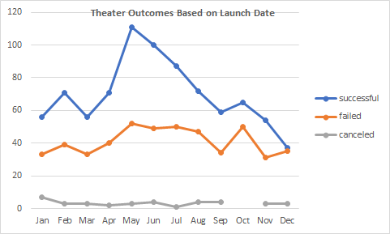
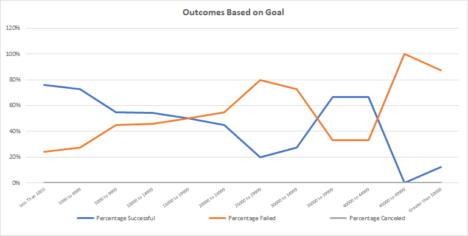

# Kickstarting with Excel

## Overview of Project
Louise’s play Fever came close to its fundraising goal in a short amount of time. Now, she wants to know how different Kickstarter campaigns fared in relation to their launch dates and their funding goals. 

### Purpose
Analyze the Kickstarter data and provide visualizations to give Louise clear insights into the campaign trends and find out if their outcomes were affected by their launch date and/or fundraising goals.

## Analysis and Challenges
The full analysis and workbook can be found here: [Kickstarter Analysis](Kickstarter_Challenge.xlsx)

### Analysis of Outcomes Based on Launch Date

First, I filtered the data solely for the theater parent category and created a line chart to visualize the relationship between outcomes and launch month, as shown below.

### Analysis of Outcomes Based on Goals

Next, I created a line chart to visualize the percentage of successful, failed, and canceled campaigns in the plays subcategory that was based on the funding goal amount, as shown below.

### Challenges and Difficulties Encountered

I encountered a challenge in GitHub adding my chart images to my README file using simple syntax. I watched a youtube tutorial to troubleshoot. I learned that I could also use html syntax to add my images to a README file, which resolved my issue.

## Results

**- What are two conclusions you can draw about the Outcomes based on Launch Date?**

  May has the highest number of successfully launched theater Kickstarter campaigns, so it appears to be the best month to launch a fundraising campaign.
  
  December seems to be the worst month for launching a theater Kickstarter campaign, with virtually the same amount of failed and successful campaigns launched in that month.

**- What can you conclude about the Outcomes based on Goals?**

  The data shows the success rate of a Kickstarter campaign in the plays subcategory is greatest when the fundraising goal is 15,000 or less. 

**- What are some limitations of this dataset?**

  There isn't a large enough sample size within the play category where goals were 25,000 or more. The 'Outcomes based on Goals' line graph demonstrates this fact. It shows the proportion of successful and failed campaigns at this level go up and down inconsistently and are therefore not a reliable source of information.
  
  As with any dataset, there might be limitations if there are potential outliers.

**- What are some other possible tables and/or graphs that we could create?**

  To continue analyzing the data for Outcomes based on Launch Date, instead of looking at the shear numbers of theater campaigns launched each month, as we've already done, it might be more meaningful to look at the relative percentage of failed vs. successful campaigns by month.

  To investigate the fundraising potential of each month further, it might be interesting to create a graph which shows successful campaigns by month and the average of their Percentage Funded calculation.

