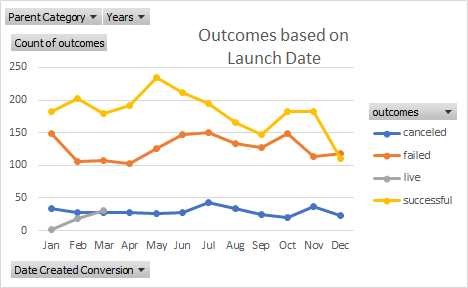

# An Analysis of Kickstarter Campaigns
Performing analysis on Kickstarter data to uncover trends

Full analysis and workbook here: [Kickstarter Data Analysis](data-1-1-3-StarterBook_cb.xlsx)

## Outcomes based on Launch Date

## Parent Category Outcomes

### Recommendations for Louise:

* Since a higher number of successful kickstarter campaigns were launched in May (see Outcomes based on Launch Date chart above), I recommend Louise launch her kickstarter in May.

* Even though the Theater subcategory has a high proportion of successful kickstarter campaigns compared to other subcategories (see Parent Category Outcomes chart above), which is great news for Louise, it's clear from the data that she should try to get her theater project produced for less than her $12,000 goal, if possible. She should try to keep her fundraising goal to around $5,000-$5,500 for a greater chance for success.  
